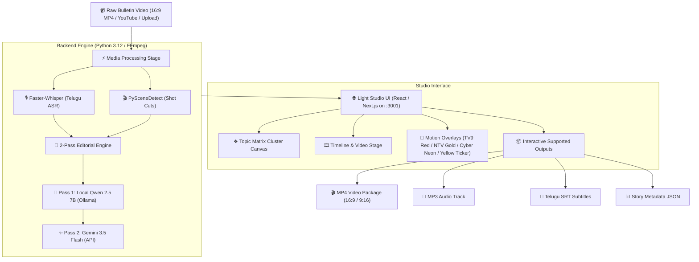

# 📺 Telugu Newsroom AI MediaOps Platform

> **Automated AI Video Intelligence & Topic Clipping Platform for Telugu TV Newsrooms**  
> *Transform 30–60 minute continuous Telugu news bulletins (16:9) into topic-segmented, evidence-backed multi-format news packages (9:16 Shorts / Reels, 16:9 YouTube, SRT Subtitles, MP3 Audio, and Story JSON).*

---

## 🎯 Mission & Core Intention

Broadcast newsrooms stream continuous, long-form 16:9 TV bulletins containing multiple back-to-back news stories (politics, sports, cinema, crime, local news). Digital news desk editors face a time-critical challenge: **extracting individual news topics into polished social video clips within minutes of broadcast.**

This platform solves that problem end-to-end:
1. **Listens & Transcribes**: Extracts audio and transcribes Telugu speech locally using Faster-Whisper.
2. **Detects Visual & Semantic Boundaries**: Analyzes scene cuts with PySceneDetect, speech pauses, and semantic shifts.
3. **AI Editorial Polish (2-Pass)**:
   - **Pass 1 (Local Qwen 2.5 7B)**: Cleans garbled speech-to-text, removes anchor intro filler (`"నమస్కారం"`, `"స్వాగതം"`), and drafts initial topic boundaries.
   - **Pass 2 (Gemini 3.5 Flash)**: Perfects 3-5 word Telugu headlines (`title`), summaries, and grammar.
4. **Interactive Studio UI**: Displays an uncluttered multi-column Canvas Matrix, Timeline Editor, and Motion Graphic Overlay Selector.
5. **Instant Multi-Format Output**: Renders 9:16 vertical crop video packages with burned-in Telugu subtitles, lower-third tickers, and exports raw MP3 audio, SRT subtitles, and JSON story data.

---

## 🏗️ End-to-End System Architecture



---

## 📂 Monorepo Structure

```
telugu-newsroom/
├── README.md                           # Comprehensive documentation
├── .gitignore                          # Unified git ignore rules
├── telugu-newsroom-pipeline/           # Python 3.12 Backend Pipeline
│   ├── adapters/                       # ASR & Editorial Adapters
│   │   ├── local_whisper_speech.py     # Faster-Whisper local ASR engine
│   │   └── local_llm_editorial.py      # Qwen 2.5 + Gemini 3.5 2-pass proofreader
│   ├── configs/default.json            # Topic segmentation & scoring rules
│   ├── requirements.txt                # Pinned Python dependencies
│   ├── scripts/                        # Setup, execution & model download scripts
│   │   ├── setup_local.sh              # 1-click dependency installer
│   │   ├── download_models.py          # Faster-Whisper & Qwen model downloader
│   │   └── run_local.py                # Pipeline server entrypoint
│   └── src/telugu_newsroom/            # Core pipeline engine (server, segmentation, rendering)
└── telugu-newsroom-ui/                 # Next.js / Vite React Frontend
    ├── app/                            # Canvas Matrix & Timeline UI pages
    │   ├── globals.css                 # Clean white studio design system
    │   └── page.tsx                    # Main Studio application component
    └── package.json                    # Frontend UI dependencies
```

---

## 🌟 Key Features & Highlights

### 1. ❖ Uncluttered Canvas Topic Cluster Matrix
- Dynamic multi-column visual matrix displaying **Topic Nodes**, **Clip Cards**, and **Output Formats**.
- Strict **Zero-Line Pass-Through Rule**: Connector curves attach cleanly to container borders without passing inside or cluttering topic boxes.

### 2. 🎨 Motion Graphic Lower-Third Overlay Templates
- **🔴 TV9 Red Studio**: Classic broadcast news red headline bar.
- **🏆 NTV Gold**: Premium metallic gold ticker with dark contrast text.
- **⚡ Cyber Neon**: High-energy neon green social overlay for Instagram & TikTok.
- **⚡ Yellow Ticker**: Breaking news yellow ticker style.

### 3. 📦 Interactive Supported Outputs (1-Click Download/Export)
- **🎬 MP4 Video Package**: Renders vertical `9:16` or landscape `16:9` video with burned-in Telugu subtitles & overlays.
- **🎵 MP3 Audio**: Direct 16kHz mono audio download for podcasts & radio syndication.
- **📝 SRT Subtitles**: Time-aligned Telugu subtitle SRT file export.
- **📊 JSON Story Data**: Structured topic metadata, confidence scores, and transcript evidence.

---

## 🚀 Quick Start Guide

### Prerequisites
- **Python**: `python3.9` or higher
- **Node.js**: `node 18+` & `npm`
- **FFmpeg**: Handled automatically via `static-ffmpeg` package (no Homebrew required).

---

### Step 1: Clone Repository & Setup Pipeline Backend

```bash
cd telugu-newsroom-pipeline

# 1-Click setup: installs requirements & downloads Faster-Whisper ASR models
./scripts/setup_local.sh
```

*(Optional)* Add your Gemini API key to `telugu-newsroom-pipeline/.env`:
```env
GEMINI_API_KEY="your_gemini_api_key_here"
EDITORIAL_BATCH_SIZE=5
```

---

### Step 2: Start the Backend Pipeline Server

```bash
# Runs API server on http://localhost:8787
bash scripts/run_local.sh
```

---

### Step 3: Start the Frontend Studio UI

Open a new terminal window:

```bash
cd telugu-newsroom-ui

# Install dependencies and start UI server
npm install
npm run dev -- --port 3001
```

---

### Step 4: Access the Newsroom Studio

Open your browser and navigate to:
👉 **`http://localhost:3001`**

Upload any long-form Telugu TV news video (`.mp4`), click **Run MediaOps Pipeline**, and watch the AI transcribe, segment, and render topic packages live!

---

## 📊 Supported Formats & Specifications

| Export Target | Aspect Ratio | Resolution | Burned Subtitles | Motion Overlay | Primary Use Case |
| :--- | :---: | :---: | :---: | :---: | :--- |
| **Instagram Reels / YouTube Shorts** | `9:16` | 1080x1920 | ✅ Included | ✅ TV9 / NTV / Neon | Social Viral Content |
| **YouTube Main Channel** | `16:9` | 1920x1080 | ✅ Included | ✅ TV9 / NTV / Neon | Broadcast & Web Stream |
| **MP3 Audio Track** | — | 16 kHz Mono | — | — | Radio / Podcast Feed |
| **SRT Subtitles** | — | UTF-8 | — | — | Video Editors / Archival |
| **JSON Story Artifact** | — | Structured | — | — | CMS & Search Indexing |

---

## 📄 License
Distributed under the MIT License. Built for Telugu TV Newsroom AI Automation.
