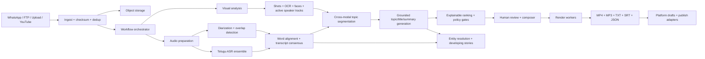

# Production Architecture

## Recommended topology



## Why this is the highest-accuracy pattern

No single model should decide transcription, speaker identity, topic boundaries,
headline wording, and clip cuts. Those failure modes are different and require
different evidence. The pipeline therefore separates five layers:

1. **Signal extraction:** speech, silence, shots, OCR, faces, motion, and active
   speaker observations remain timestamped.
2. **Recognition:** use two independent Telugu ASR passes for important content,
   plus a separate diarization/overlap model. Reconcile disagreements and send low
   confidence spans to review.
3. **Cross-modal understanding:** detect topic transitions from transcript meaning,
   pauses, speaker transitions, and scene changes together. A shot cut alone is not
   a topic change; a transcript change alone may occur mid-sentence.
4. **Editorial generation:** a strong multilingual reasoning model receives only a
   candidate's evidence window and returns structured topic, subtopic, title,
   summary, named entities, and confidence signals.
5. **Deterministic assembly and governance:** code—not an LLM—applies time ranges,
   overlap detection, score weights, review state, platform limits, rendering, and
   audit records.

Qwen and Gemma are not required or assumed anywhere in this design.

## Production services

| Concern | Production choice | Reference implementation |
|---|---|---|
| Workflow | Temporal, durable queue, or managed workflow engine | `Pipeline` with resumable artifacts |
| Metadata | PostgreSQL | Job-local JSON contracts |
| Media | S3-compatible object storage + signed URLs | Job-local files |
| Search | OpenSearch plus vector index | Entity JSON pages |
| Compute | Separate CPU and GPU worker pools | CLI stages |
| API | Authenticated service with RBAC | Standard-library HTTP server |
| Observability | Per-stage latency, GPU time, confidence, failure codes | Manifest status/error |
| Rendering | Autoscaled FFmpeg workers | FFmpeg command builder |

The reference code deliberately keeps the domain logic independent from those
infrastructure choices. Replace the storage and orchestration shells at scale;
retain the artifact contracts and quality gates.

## Accuracy stack

### Audio

- Demux to lossless mono 16 kHz PCM while retaining the original track for output.
- Apply VAD/noise diagnostics before ASR; do not aggressively denoise broadcast audio.
- Run a Telugu-specialist ASR and a second high-quality multilingual ASR for
  verification on names, numbers, quotations, and low-confidence spans.
- Use word-level forced alignment after transcript reconciliation.
- Run diarization and overlapping-speech detection separately, then assign speakers
  to words by time intersection.
- Resolve real names only from verified newsroom metadata, visible lower-thirds, or
  an editor action. Keep raw labels such as `SPEAKER_01` otherwise.

### Visuals

- Detect hard cuts and gradual transitions.
- Sample keyframes per shot plus frames around proposed boundaries.
- OCR lower-thirds, tickers, podium text, and location boards; keep bounding boxes and
  confidence.
- Detect/track faces and active speakers for 9:16/4:5/1:1 reframing.
- Use a multimodal model for semantic scene descriptions, but ground its output in
  frame IDs and OCR evidence.

### Clip selection

- First produce a non-overlapping topic partition of the full video.
- Optionally create shorter highlight alternatives inside those topics.
- Show overlap badges between alternatives so editors do not publish duplicates.
- Rank on editorial importance, hook, completeness, speaker/audio clarity, and
  visual quality; retain every component and penalty.

## Storage contract

Each job is immutable-by-stage and auditable:

```text
jobs/{job_id}/
  manifest.json
  input/source.mp4
  analysis/audio.wav
  analysis/probe.json
  analysis/waveform.json
  analysis/shots.json
  analysis/transcript.json
  analysis/transcript.srt
  analysis/boundaries.json
  analysis/timeline.json
  analysis/clips.json
  analysis/quality.json
  analysis/publish.json
  analysis/entities.json
  renders/{clip_id}/{aspect}/
    {clip_id}.mp4
    {clip_id}.mp3
    transcript.txt
    transcript.srt
    package.json
```

## Human gates

- **Transcript gate:** names, numbers, allegations, quotations, and low-confidence spans.
- **Clip gate:** IN/OUT points, completeness, overlap, speaker attribution, and crop.
- **Copy gate:** headline/body faithfulness and platform-specific edits.
- **Publish gate:** final editor identity, timestamp, source lineage, and destination.

`quality.json` is the minimum gate in the reference build. A production policy
service should turn those findings into role-specific approvals and an audit log.

